# Jarkom-Modul-4-C07-2021

Kelompok C07

|      NRP       |                  Nama                   |
| :------------: | :-------------------------------------: |
| 05111940000046 |       Titian Pamungkas Anjasmara        |
| 05111940000134 |           Ahmad Lamaul Farid            |
| 05111940000150 | Jonathan Leonardo Hasiholan Simanjuntak |

# CPT - VLSM

Pertama - tama, bagi topologi yang sudah diberikan ke dalam beberapa subnet kecil sesuai kebutuhan :

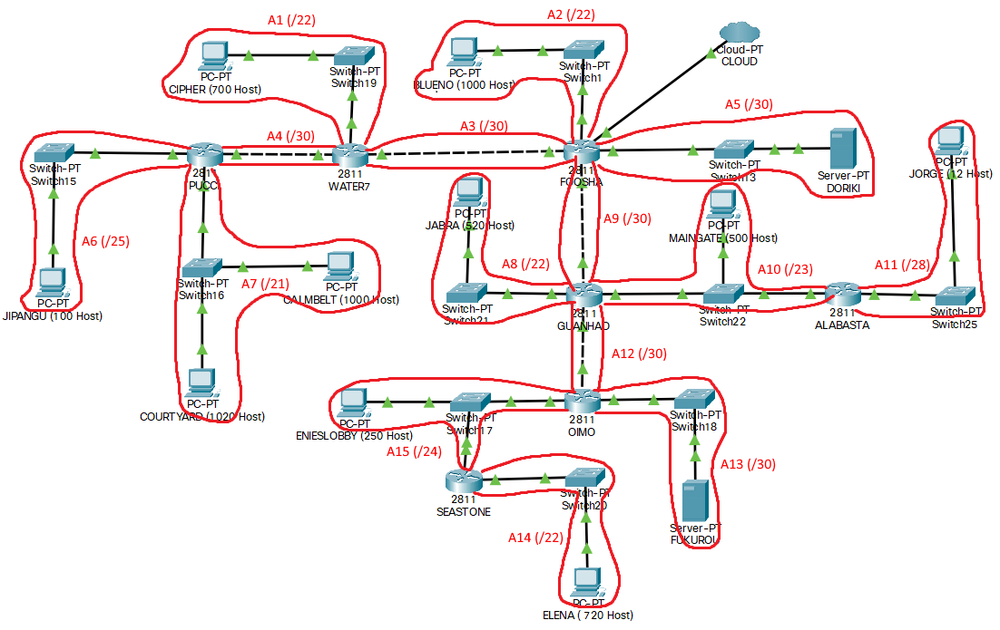

Tentukan jumlah IP yang diperlukan beserta dengan netmasknya untuk setiap subnet yang ada :

|  Subnet   | Jumlah IP | Netmask |
| :-------: | :-------: | :-----: |
|    A1     |    701    |   /22   |
|    A2     |   1001    |   /22   |
|    A3     |     2     |   /30   |
|    A4     |     2     |   /30   |
|    A5     |     2     |   /30   |
|    A6     |    101    |   /25   |
|    A7     |   2021    |   /21   |
|    A8     |    521    |   /22   |
|    A9     |     2     |   /30   |
|    A10    |    502    |   /23   |
|    A11    |    13     |   /28   |
|    A12    |     2     |   /30   |
|    A13    |     2     |   /30   |
|    A14    |    721    |   /22   |
|    A15    |    252    |   /24   |
| **Total** | **5845**  | **/19** |

Berdasarkan data tersebut, susun tree subnet VLSM seperti berikut :

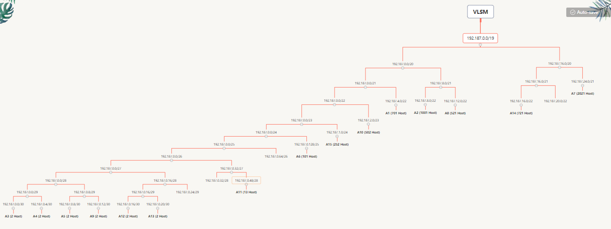

Dengan demikian, didapatkan NID untuk masing - masing subnet sebagai berikut :

|  Subnet   | Jumlah IP | Netmask |      NID      |
| :-------: | :-------: | :-----: | :-----------: |
|    A1     |    701    |   /22   |  192.187.4.0  |
|    A2     |   1001    |   /22   |  192.187.8.0  |
|    A3     |     2     |   /30   |  192.187.0.0  |
|    A4     |     2     |   /30   |  192.187.0.4  |
|    A5     |     2     |   /30   |  192.187.0.8  |
|    A6     |    101    |   /25   | 192.187.0.128 |
|    A7     |   2021    |   /21   | 192.187.24.0  |
|    A8     |    521    |   /22   | 192.187.12.0  |
|    A9     |     2     |   /30   | 192.187.0.12  |
|    A10    |    502    |   /23   |  192.187.2.0  |
|    A11    |    13     |   /28   | 192.187.0.48  |
|    A12    |     2     |   /30   | 192.187.0.16  |
|    A13    |     2     |   /30   | 192.187.0.20  |
|    A14    |    721    |   /22   | 192.187.16.0  |
|    A15    |    252    |   /24   |  192.187.1.0  |
| **Total** | **5845**  | **/19** |

Masing - masing interface pada sebuah subnet dapat diberikan IP sesuai dengan aturan yang telah diberikan di atas.

- Foosha
```
IP 192.187.8.1
Subnet Mask 255.255.252.0  // Menuju Blueno
```
```
IP 192.187.0.13
Subnet Mask 255.255.252.0  // Menuju Guanhao
```
```
IP 192.187.0.1
Subnet Mask 255.255.252.0  // Menuju Water7
```
```
IP 192.187.0.9
Subnet Mask 255.255.252.0  // Menuju Doriki
```

## Routing

Pada kasus topologi yang sudah kami buat ini, route table yang ada pada masing - masing router adalah sebagai berikut :

- PUCCI
  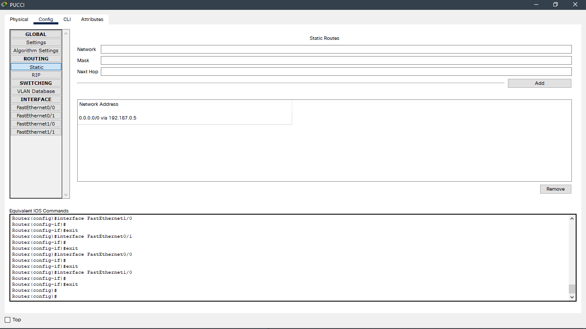

- Water7
  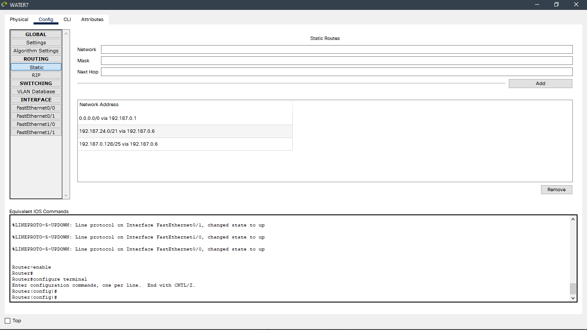

- Foosha
  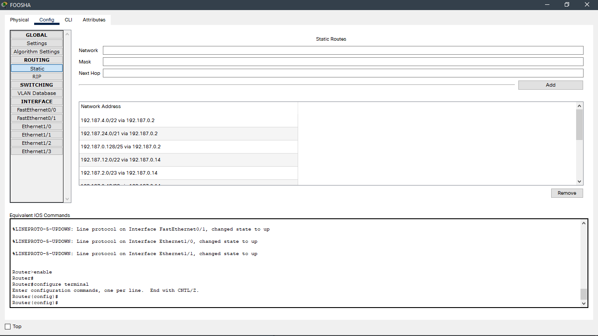

  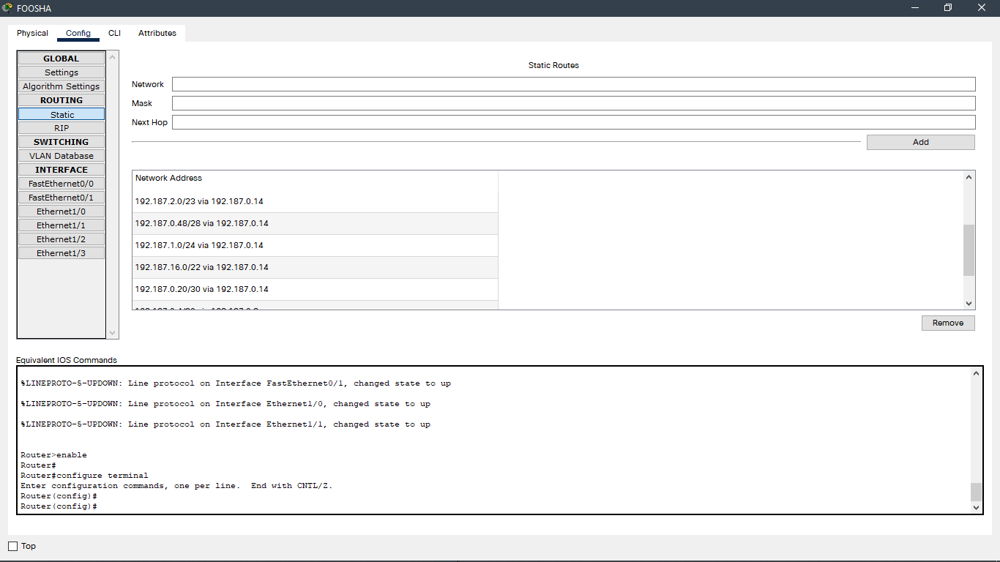

  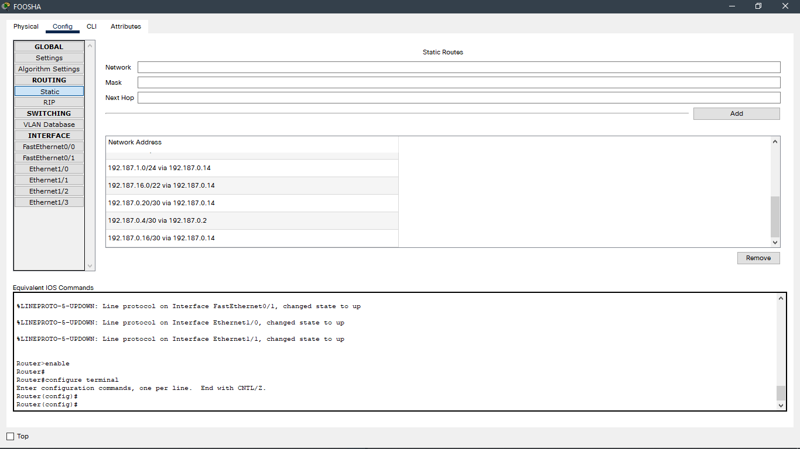

- Guanhao
  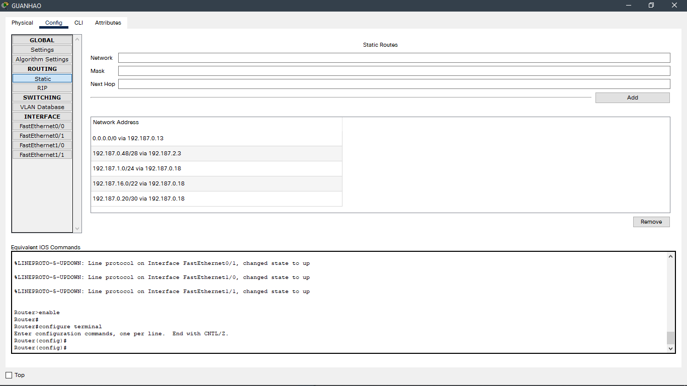

- Alabasta
  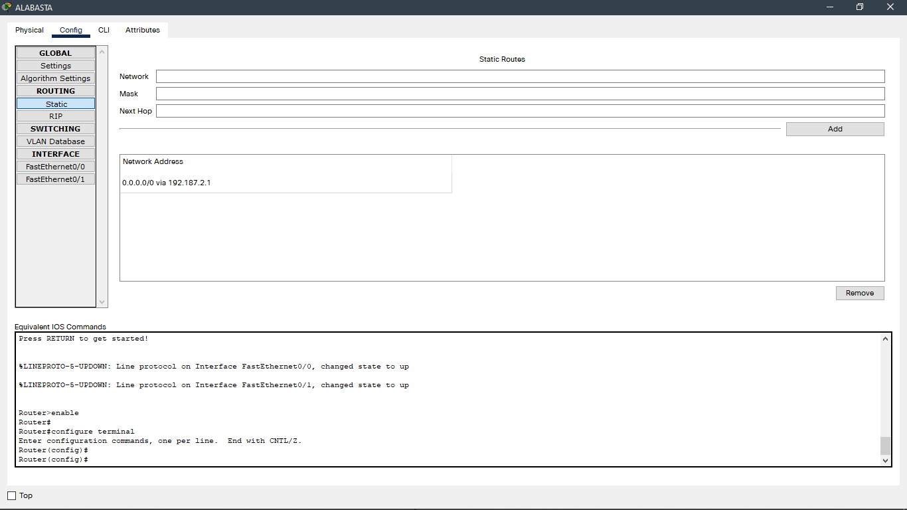

- Oimo
  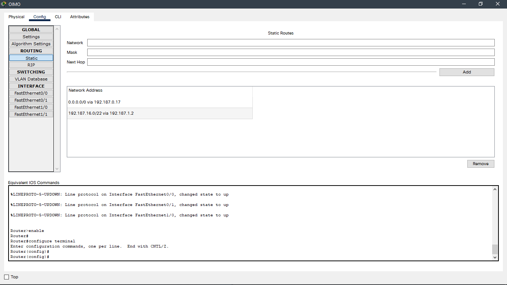

- Seastone
  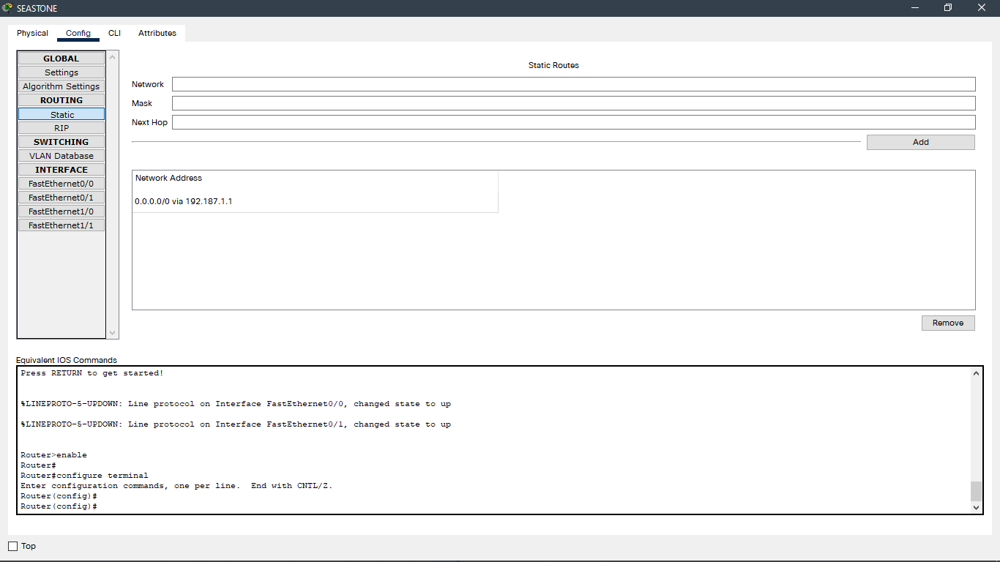

## Testing

Berikut adalah beberapa testing ping yang dilakukan :

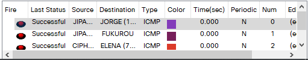

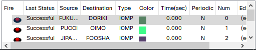

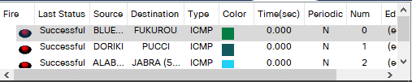

# GNS3 - CIDR

Pembagian subnet di CIDR dimulai dari yang terjauh dari cloud agar mempermudah routing sehingga didapatkan subnet sebagai berikut :


Dari gambar diatas dapat kita buat tree subnet CIDR seperti berikut :


| Subnet | Jumlah IP | Netmask |      NID      |
| :----: | :-------: | :-----: | :-----------: |
|   A1   |    701    |   /22   | 192.187.32.0  |
|   A2   |   1001    |   /22   | 192.187.128.0 |
|   A3   |     2     |   /30   | 192.187.64.0  |
|   A4   |     2     |   /30   | 192.187.16.0  |
|   A5   |     2     |   /30   | 192.188.64.0  |
|   A6   |    101    |   /25   |  192.187.8.0  |
|   A7   |   2021    |   /21   |  192.187.0.0  |
|   A8   |    521    |   /22   | 192.188.20.0  |
|   A9   |     2     |   /30   | 192.188.32.0  |
|  A10   |    502    |   /23   | 192.188.16.0  |
|  A11   |    13     |   /28   | 192.188.18.0  |
|  A12   |     2     |   /30   | 192.188.24.0  |
|  A13   |     2     |   /30   |  192.188.8.0  |
|  A14   |    721    |   /22   |  192.188.0.0  |
|  A15   |    252    |   /24   |  192.188.4.0  |

Kemudian buat topologi pada GNS3 seperti berikut :


Untuk configurasi pada topologi GNS3 diatas sebagai berikut :


Setelah melakukan configurasi seperti gambar diatas, maka langkah selanjutnya adalah routing. Untuk routingnya dilakukan pada node Foosha, Water7, Guanhao, Oimo seperti pada gambar berikut :


Ketikkan perintah `echo nameserver 192.168.122.1 > /etc/resolv.conf` pada setiap node yang ada di topologi GNS3 agar semua node dapat mengakses internet

## Testing

Lakukan ping antar node atau ke jaringan luar. Disini kami menggunakan `ping youtube.com` dengan testing nodenya `Fukurou`. Jika semua routing kita sudah benar maka kita dapat melakukan `ping` seperti pada gambar berikut :


_PS : Pastikan semua node dapat melakukan ping seperti gambar diatas_
