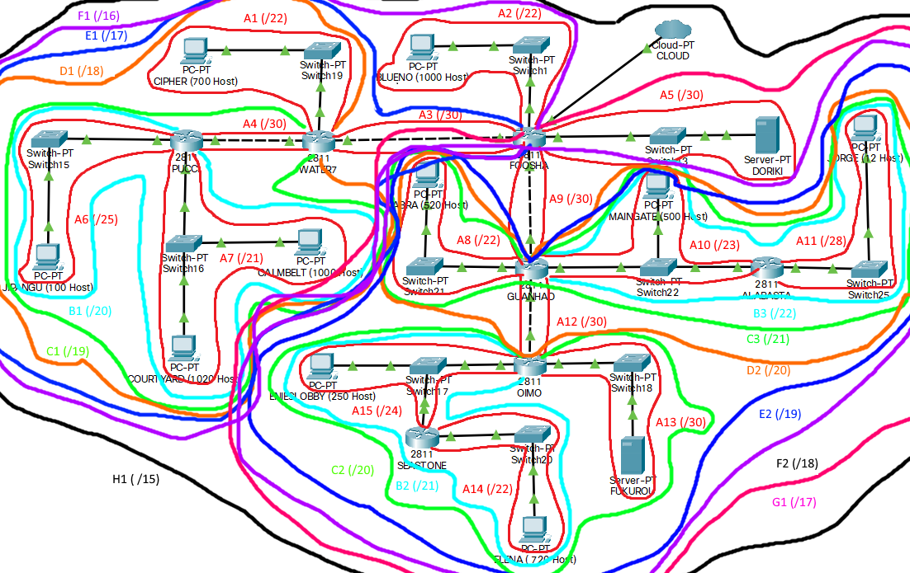

# Jarkom-Modul-4-C07-2021

Kelompok C07

|      NRP       |                  Nama                   |
| :------------: | :-------------------------------------: |
| 05111940000046 |       Titian Pamungkas Anjasmara        |
| 05111940000134 |           Ahmad Lamaul Farid            |
| 05111940000150 | Jonathan Leonardo Hasiholan Simanjuntak |

**CPT - VLSM**

**GNS3 - CIDR**

Pembagian subnet di CIDR dimulai dari yang terjauh dari cloud agar mempermudah routing sehingga didapatkan subnet sebagai berikut :

Dari gambar diatas dapat kita buat tree subnet CIDR seperti berikut :

| Subnet | Jumlah IP | Netmask |      NID      |
| :----: | :-------: | :-----: | :-----------: |
|   A1   |    701    |   /22   | 192.187.32.0  |
|   A2   |   1001    |   /22   | 192.187.128.0 |
|   A3   |     2     |   /30   | 192.187.64.0  |
|   A4   |     2     |   /30   | 192.187.16.0  |
|   A5   |     2     |   /30   | 192.188.64.0  |
|   A6   |    101    |   /25   |  192.187.8.0  |
|   A7   |   2021    |   /21   |  192.187.0.0  |
|   A8   |    521    |   /22   | 192.188.20.0  |
|   A9   |     2     |   /30   | 192.188.32.0  |
|  A10   |    502    |   /23   | 192.188.16.0  |
|  A11   |    13     |   /28   | 192.188.18.0  |
|  A12   |     2     |   /30   | 192.188.24.0  |
|  A13   |     2     |   /30   |  192.188.8.0  |
|  A14   |    721    |   /22   |  192.188.0.0  |
|  A15   |    252    |   /24   |  192.188.4.0  |

Kemudian buat topologi pada GNS3 seperti berikut :

Untuk configurasi pada topologi GNS3 diatas sebagai berikut :

Setelah melakukan configurasi seperti gambar diatas, maka langkah selanjutnya adalah routing. Untuk routingnya dilakukan pada node Foosha, Water7, Guanhao, Oimo seperti pada gambar berikut :

Ketikkan perintah `echo nameserver 192.168.122.1 > /etc/resolv.conf` pada setiap node yang ada di topologi GNS3 agar semua node dapat mengakses internet

**Testing**

Lakukan ping antar node atau ke jaringan luar. Disini kami menggunakan `ping youtube.com` dengan testing nodenya `Fukurou`. Jika semua routing kita sudah benar maka kita dapat melakukan `ping` seperti pada gambar berikut :

_PS : Pastikan semua node dapat melakukan ping seperti gambar diatas_
